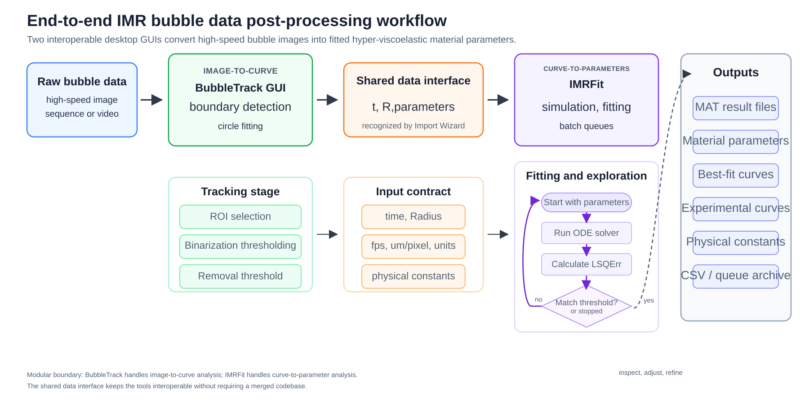

# Summary

IMRFit is an open-source Python desktop application for simulating and fitting radius--time curves from inertial microrheology (IMR) bubble experiments. In laser-induced cavitation IMR, a rapidly expanding and collapsing bubble deforms the surrounding material at high strain rates, and material parameters are inferred by comparing the measured bubble radius--time curve against a forward bubble-dynamics model [@estrada_high_2018; @yang_extracting_2020]. IMRFit provides an interactive environment for importing experimental data, selecting constitutive models, running Keller--Miksis or Rayleigh--Plesset simulations [@rayleigh_viii_1917; @plesset_dynamics_1949; @keller_bubble_1980], fitting model parameters, managing batch fitting queues, and comparing large collections of experimental and simulated curves.

The software replaces a script-heavy MATLAB workflow with a graphical, reproducible, and extensible Python workflow based on PySide6, NumPy, SciPy, and Matplotlib [@pyside6; @virtanen_scipy_2020; @hunter_matplotlib_2007]. It includes built-in Neo-Hookean Kelvin--Voigt and generalized Maxwell--Ogden damage models and supports user-defined models through JSON descriptors and Python solver entry points. IMRFit also interoperates with the companion BubbleTrack GUI [@bubbletrack], which performs the upstream image-analysis step required to convert high-speed bubble images into calibrated radius--time data.

# Statement of need

Extracting material parameters from IMR bubble data is a nonlinear inverse problem. Each objective-function evaluation requires solving a bubble-dynamics ordinary differential equation coupled to a constitutive model, comparing the simulated curve with experimental data over a selected fitting window, and iterating until an acceptable parameter set is found. In practice, this process is sensitive to choices that are difficult to manage reproducibly in ad hoc scripts: the fitting window, experimental unit conversions, equilibrium-radius metadata, optimizer settings, parameter bounds, and model-specific scaling rules.

Researchers using IMR often need to inspect many candidate fits rather than a single numerical optimum. Different optimizers may converge to different local minima, and a fitted parameter set may match one part of the curve while failing to reproduce another. Users also need to test how individual physical and constitutive parameters change features such as collapse timing, rebound amplitude, damping, and the long-time return toward equilibrium. These tasks motivate an interactive tool that keeps the data, model, solver, optimizer, fitting window, and exported results visible and traceable.

IMRFit addresses this need by exposing the full curve-fitting workflow in a desktop application. The Import Wizard handles MATLAB MAT files with varied field names, SI or micrometer/microsecond units, pixel-to-length calibration, missing time axes reconstructed from frame rate, optional data cleanup, and learned variable-name recognition. The fitting interface lets users switch between dimensional and normalized views, define manual or automated fitting windows, run forward simulations, fit parameters, and export result files. The job-list system supports batch fitting or simulation sweeps, including parallel execution and queue import/export. The floating Curve View panel enables visual comparison of many experimental and simulated curves and supports publication-oriented SVG/MAT export.

# State of the field

The physical basis of IMR bubble analysis has been developed in prior work on inertial cavitation and nonlinear viscoelastic property extraction [@estrada_high_2018; @yang_extracting_2020]. Bubble dynamics models such as Rayleigh--Plesset and Keller--Miksis provide the forward model for radius--time simulation [@rayleigh_viii_1917; @plesset_dynamics_1949; @keller_bubble_1980]. Existing workflows in our group used MATLAB scripts to couple these models to constitutive laws and derivative-free optimizers. Although such scripts were scientifically useful, they made routine analysis labor-intensive: active files and parameters were often implicit, repeated experiments required manual editing, and visual comparison across models or parameter sweeps required separate plotting scripts.

General numerical libraries such as SciPy provide robust ODE solvers and optimizers [@virtanen_scipy_2020], and Matplotlib provides plotting [@hunter_matplotlib_2007], but these libraries do not by themselves define the domain-specific workflow required for IMR bubble fitting. IMRFit packages these components into a research application tailored to IMR data: it manages experimental curves, physical constants, constitutive parameters, fitting windows, optimizer settings, and exportable results in one interface while remaining compatible with the MAT-file ecosystem used by existing laboratory scripts.

# Software design

IMRFit is organized around a model-driven architecture. The user interface is implemented in PySide6 and embeds Matplotlib canvases for previewing experimental data, simulations, best-fit curves, and multi-curve comparison panels. Numerical work is performed with NumPy and SciPy. Experimental data and fitting results are exchanged primarily as MATLAB MAT files, which allows the application to interoperate with existing analysis scripts and the BubbleTrack image-analysis GUI.

Constitutive models are described by JSON files that define the model name, parameter list, default values, bounds, display units, scaling behavior, and solver entry point. Solver modules receive the current parameter dictionary and physical context, run the selected bubble dynamics calculation, and return simulated radius--time arrays and diagnostic quantities. This separation allows the GUI to populate controls dynamically from model descriptors rather than hard-coding every parameter field. It also allows advanced users to add new constitutive assumptions without rewriting the main application.

The fitting engine treats each objective-function evaluation as a forward simulation followed by least-squares comparison over the active fitting window. Direct fitting and queued fitting use the same objective logic so that single-run and batch-run results are comparable. The job-list module stores snapshots of the experimental data, model key, parameter values, bounds, optimizer settings, fitting window, physical constants, and output metadata. Completed jobs can be previewed, removed, reordered, exported, reloaded into the editor, or archived as queue files.

The software includes built-in tools for common IMR analysis tasks. Automatic fitting-window selection can identify a chosen number of bubble oscillation cycles, reducing off-by-one-point inconsistencies that can strongly affect the objective function. Batch simulation jobs support parameter sweeps, and generated result files include legend metadata for downstream curve comparison. Curve View supports distinct and gradient color palettes, manual reordering, visibility toggles, line-width editing, MAT export, SVG export, and clipboard export. Together these tools support both parameter extraction and model exploration.

# Research impact

IMRFit improves the reproducibility and efficiency of IMR bubble analysis by replacing implicit script state with visible, saved, and exportable analysis state. Users can inspect how model choice, initial values, parameter bounds, fitting windows, and optimizer settings affect the fitted curve. Batch queues make systematic processing of many experiments practical, while Curve View makes parameter sweeps and model comparisons easier to interpret. The plugin mechanism provides a common testing environment for new constitutive models, allowing researchers to compare candidate material descriptions against the same experimental curves and fitting logic.

The tool is intended for researchers analyzing high-rate soft-material, polymer, gel, and tissue experiments using laser-induced cavitation bubbles. Together with BubbleTrack, it provides a practical end-to-end path from raw high-speed image sequences to fitted material parameters while preserving modularity between image tracking and mechanical model fitting. The current release is a research-ready foundation for IMR data analysis and for future extensions such as guided initial-guess selection, compiled solver interfaces, and broader curve-fitting workflows.

# AI usage disclosure

Large language models were used as an assistive tool during software development, documentation drafting, and preparation of this manuscript. AI-generated suggestions were manually reviewed, edited, and tested by the authors. Scientific model choices, numerical validation, interpretation of fitting behavior, and final manuscript content remain the responsibility of the authors.

# Acknowledgements

TODO: Add funding sources, laboratory support, and acknowledgements for collaborators and users who tested early versions of the software.

# References
